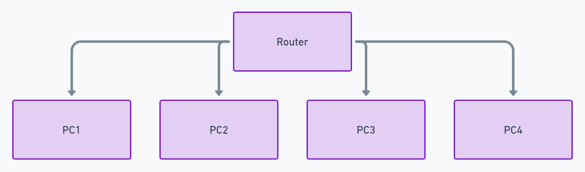

# Home-Network-Setup
A Basic Setup and configuration of a home network for stable connectivity.
# Home Network Setup

## Project Description
This project demonstrates the setup and configuration of a home network to ensure stable connectivity for multiple devices. The setup includes configuring a wireless router, creating a basic LAN with wired connections, and implementing basic security measures.

## Key Tasks
- Configured a wireless router with WPA2 encryption.
- Created a LAN setup with wired connections for desktop computers.
- Monitored and tested network performance to ensure stability.

## Files
- **Network-Diagram.png**: Diagram illustrating the network setup.
- **Router-Configuration.txt**: Configuration settings for the router.
- **Security-Settings.md**: Documentation of the security measures implemented.

## Steps
1. **Router Setup**: Configured the router with a strong password and WPA2 encryption.
2. **LAN Configuration**: Connected desktop computers to the router via Ethernet cables.
3. **Network Testing**: Used Ping and Traceroute commands to ensure connectivity and performance.

## Conclusion
This setup provides a stable and secure network environment for home use.

